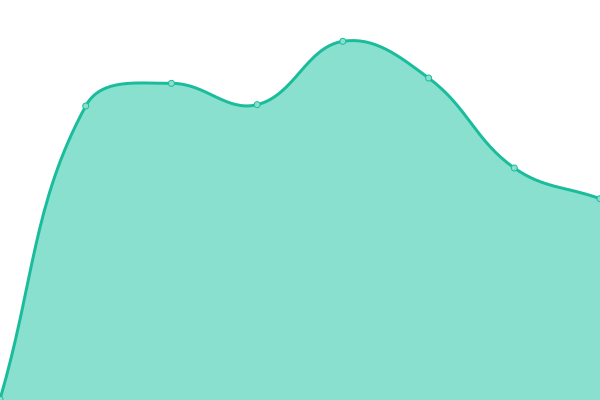

# [📈 Live Status](https://up.deveji.com): <!--live status--> **🟧 Partial outage**

This repository contains the open-source uptime monitor and status page for [Deveji](www.deveji.com), powered by [Upptime](https://github.com/upptime/upptime).

With [Upptime](https://upptime.js.org), you can get your own unlimited and free uptime monitor and status page, powered entirely by a GitHub repository. We use [Issues](https://github.com/Deveji/Deveji-Uptime-Monitor/issues) as incident reports, [Actions](https://github.com/Deveji/Deveji-Uptime-Monitor/actions) as uptime monitors, and [Pages](https://up.deveji.com) for the status page.

<!--start: status pages-->
<!-- This summary is generated by Upptime (https://github.com/upptime/upptime) -->
<!-- Do not edit this manually, your changes will be overwritten -->
<!-- prettier-ignore -->
| URL | Status | History | Response Time | Uptime |
| --- | ------ | ------- | ------------- | ------ |
|  [Deveji Website](https://www.deveji.com/) | 🟥 Down | [deveji-website.yml](https://github.com/Deveji/Deveji-Uptime-Monitor/commits/HEAD/history/deveji-website.yml) | 

 2848ms
     
 | 

<a href="https://up.deveji.com/history/deveji-website">100.00%</a>
    

|  Deveji n8n | 🟩 Up | [deveji-n8n.yml](https://github.com/Deveji/Deveji-Uptime-Monitor/commits/HEAD/history/deveji-n8n.yml) | 

 1648ms
     
 | 

<a href="https://up.deveji.com/history/deveji-n8n">25.57%</a>
    

|  Deveji Baserow | 🟩 Up | [deveji-baserow.yml](https://github.com/Deveji/Deveji-Uptime-Monitor/commits/HEAD/history/deveji-baserow.yml) | 

 675ms
     
 | 

<a href="https://up.deveji.com/history/deveji-baserow">55.97%</a>
    

|  Deveji Portainer | 🟩 Up | [deveji-portainer.yml](https://github.com/Deveji/Deveji-Uptime-Monitor/commits/HEAD/history/deveji-portainer.yml) | 

 322ms
     
 | 

<a href="https://up.deveji.com/history/deveji-portainer">55.98%</a>
    

|  [Bottles Genieprinter](https://bottles.genieprinter.com/) | 🟩 Up | [bottles-genieprinter.yml](https://github.com/Deveji/Deveji-Uptime-Monitor/commits/HEAD/history/bottles-genieprinter.yml) | 

 252ms
     
 | 

<a href="https://up.deveji.com/history/bottles-genieprinter">100.00%</a>
    

<!--end: status pages-->

[**Visit our status website →**](https://up.deveji.com)

## 📄 License

- Powered by: [Upptime](https://github.com/upptime/upptime)
- Code: [MIT](./LICENSE) © [Anand Chowdhary](https://anandchowdhary.com), supported by [Pabio](https://pabio.com)
- Data in the `./history` directory: [Open Database License](https://opendatacommons.org/licenses/odbl/1-0/)
